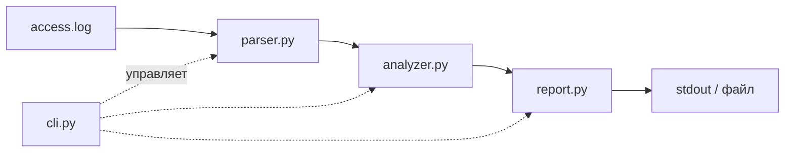

# Log Analyzer

CLI-инструмент для анализа access-логов сервера (Apache/Nginx combined format).
Считает топ IP по количеству запросов, статистику по статус-кодам, топ запрашиваемых путей.

## Установка

```bash
git clone git@github.com:kazumasatovich/Log-analyzer.git
cd log-analyzer
python3 -m venv .venv
source .venv/bin/activate
pip install -e .
```

## Запуск

```bash
log-analyzer <путь-к-логу> --top 10 --format text
```

## Архитектура проекта



## Примеры отчёта

### Формат text

```
Всего запросов: 16

Топ IP:
1 - 192.168.1.10: 5
2 - 10.0.0.5: 5
3 - 203.0.113.7: 4
4 - 192.168.1.99: 2

Топ статусов:
1 - 200: 10
2 - 403: 1
3 - 404: 3
4 - 500: 2

Топ путей:
1 - /index.html: 3
2 - /products: 3
3 - /about.html: 1
4 - /api/users: 1
5 - /api/login: 1
6 - /products/123: 1
7 - /api/orders: 1
8 - /admin: 1
9 - /api/users/5: 1
10 - /contact: 1
11 - /wp-login.php: 1
12 - /api/health: 1
```

### Формат json

```json
{
 "top_ips": [["192.168.1.10", 5], ["10.0.0.5", 5], ["203.0.113.7", 4], ["192.168.1.99", 2]],
 "status_counts": {"200": 10, "404": 3, "500": 2, "403": 1},
 "top_paths": [["/index.html", 3], ["/products", 3], ["/about.html", 1]],
 "total_requests": 16
}
```